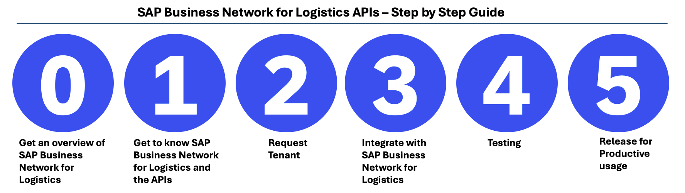
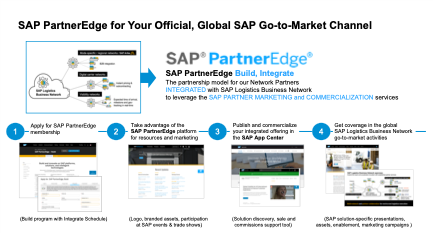

The goal of this page is to provide a description of the required steps and the required sequence of the same, in order to integrate against SAP Business Network for Logistics APIs. Therefore the content is targeting the developer persona, that has mostly worked as an integration specialist. The description is valid for both, SAP Business Network Freight Collaboration (FC), as well as SAP Business Network Global Track and Trace (GTT).

Questions can be raised via the GitHub issues section within this repository. The issues section is being monitored actively - [**ask a question**](https://github.com/SAP-samples/logistics-business-network-integration/issues) and please also check the [FAQ section](https://github.com/SAP-samples/logistics-business-network-integration/wiki/FAQ).
You might also want to take a look at the below [glossary](https://github.com/SAP-samples/logistics-business-network-integration#glossary).

## 0.) Get an overview of SAP Business Network for Logistics

[**Click here**](https://sapvideoa35699dc5.hana.ondemand.com/?entry_id=1_kse4obrb) to view a video introduction session for SAP Business Network for Logistics - an introduction for carrier networks! [**Click here**](https://sapvideoa35699dc5.hana.ondemand.com/?entry_id=1_o1pafhm5) to view a video introduction session for SAP Business Network for Logistics - for API enabled carriers!

Feel free to click through [**these slides**](Upload/SAP_LBN_FC_FOR_CARRIER_NETWORKS.pdf) to get further information on the carrier networks. [**These slides**](Upload/SAP_LBN_FC_FOR_CARRIERS.pdf) will show you more information about API enabled carriers.

## 1.) Get to know SAP Business Network for Logistics and APIs

All SAP Business Network for Logistics APIs are documented in SAP API hub. 
To view the relevent SAP Business Network Freight Collaboration (FC) APIs **click [here]**(https://api.sap.com/package/LbnFreightCollaborationTenderingSubcontracting?section=Artifacts) and filter based on type 'Rest'.
To view the relevent SAP Business Network Global Track and Trace (GTT) APIs **click [here]**(https://api.sap.com/package/LbnGlobalTrackAndTrace?section=Artifacts) and filter based on type 'Rest'.
This video will provide you an overview of the APIs used for the various SAP Business Network Freight Collaboration scenarios [**click here**](https://sapvideoa35699dc5.hana.ondemand.com/?entry_id=1_56hc08n2).

Additionally, to understand the details of the individual scenarios click on the listed description below.
You can view the slides used in these presentations by clicking on this [**link**](Upload/APIOverviewSlides.pdf).
  - [Tendering API](https://sapvideoa35699dc5.hana.ondemand.com/?entry_id=1_arll0fdg)
  - [Subcontracting API](https://sapvideoa35699dc5.hana.ondemand.com/?entry_id=1_0nq8qf49)
  - [Tracking API](https://sapvideoa35699dc5.hana.ondemand.com/?entry_id=1_z9pmf751)
  - [Invoicing API](https://www.kaltura.com/p/1921661/sp/192166100/embedIframeJs/uiconf_id/37285991/partner_id/1921661?iframeembed=true&playerId=kaltura_player&entry_id=1_svh81jiy)
 
For SAP Business Network Global Track and Trace you can refer to the same Tracking API description as for SAP Business Network Freight Collaboration above, as they are the same: [**Tracking API**](https://sapvideoa35699dc5.hana.ondemand.com/?entry_id=1_z9pmf751).

The administration guide for carriers can be found [here](https://help.sap.com/doc/3b6fba06913f47e29cff45d3e4f1f1cd/LBN/en-US/loiob076fa7d5070490582c68d261c20d5e8_EN.pdf) - it contains the following topics:
- Onboarding
- Business Configuration
- Connectivity
- Security and Data Protection and Privacy
- Monitoring & Troubleshooting

## 2.) Request B2B test tenant and test technical user

Before you can actually start connecting against SAP Business Network for Logistics, you need to request the two below items:
- Request B2B test tenant
- Request test technical user

### 2.1) Request B2B test tenant

As a prerequisit for connecting to / integrating with SAP Business Network for Logistics APIs,
you are required to have tenants in SAP Business Network for Logistics available which are specific to your company.

For this you will have to request two tenants, one that will serve the development and test purposes,
and a second one for productive usage.

This section focuses on requesting the development/test tenant.
Section 5 will guide you through requesting your productive tenant.

 

#### A. Tenant and License description ###

License Nr 8007828 – Free of Charge *Test tenant to develop & test connectivity with standard SAP Business Network for Logistics APIs* 
* For carrier/partner integration phase: mapping to SAP Business Network for Logistics APIs and end-to-end testing for both SAP Business Network Freight Collaboration & Global Track and Trace  
* Also for customer testing/implementation project with testing of integration to the partner network

#### B. License coverage details
* SAP Business Network for Logistics B2B Test Tenant for carriers and network partners
* License to set-up B2B connections for
  * Mapping to SAP Business Network for Logistics standard APIs
  * Integration testing 
  * Set-up and testing of B2B connections with SAP Business Network for Logistics shipper customer test tenants
* An unlimited number of connections 
* Related usage of SAP Cloud Identity and SAP Fiori
* Standard SAP cloud support for SAP Business Network for Logistics and standard APIs

#### C. Requesting the B2B test tenant 

Please request your B2B test tenant via following URL: https://store.sap.com/dcp/en/configure/vc/product/entityKey/000000000008900523?LIC_READONLY_ATTRIBUTES=LIC_RENEWAL_TYPE,LIC_EDITION&LIC_HIDE_ATTRIBUTES=LIC_EU_ACCESS&LIC_START_DATE=TODAY&LIC_EDITION=TESTTENANT&LIC_DURATION_SEL=12&LIC_RENEWAL_TYPE=AUTO&reset=true

<!-- Original Link :https://www.sapstore.com/solutions/46401/SAP-Logistics-Business-Network%2C-B2B-test-tenant . -->

> By default, B2B test tenants use data centers in Europe. If you want your tenant to use a data center in the U.S., enter US20 in the PO-Number field on the Review Order Details page.

#### D. Configuring the B2B test tenant

To perform the remaining configurations of your B2B test tenant please follow the content of the following [document](https://help.sap.com/viewer/b29693ac52074747b7010a02932fe47d/LBN/en-US). This contains important settings, like for example enabling business partner entry and discovery in the business partner directory.

### 2.2) Request test technical user

>[!NOTE]
> The below steps are only relevant for old carriers who use *Neo* as the Integration platform option for inbound communication into BNL.
>
> For all the SAP Business Network for Logistics provider APIs (inbound to SAP Business Network for Logistics), when you call our endpoint, you would need to  procure an OAuth 2.0 client ID and secret. This can be procured by reporting an incident. Use the application component SBN-LBN-INT in [SAP support portal](https://support.sap.com/). Please mention the SAP Business Network for Logistics ID created for your account and the email address you want to recieve your client ID and secret at. To know the SAP Business Network for Logistics ID, login to SAP LBN  and open the manage business profile tile. Additionally, please mention the LBN API endpoints you intend to connect in the incident. The list is mentioned below
>* Provider API for Freight Booking
>* Provider API for Freight Subcontracting
>* Provider API for Freight Tendering
>* Provider API for Invoicing
>* Provider API for Order Events

> [!IMPORTANT]
>If you are a new carrier or a carrier who is currently building integration, you do not need to request for a technical user as described above, but rather can create it yourself by following the steps below:
>1. Go to *System Connections* application. 
>2. Click on *Connection Settings*. 
>3. In the Inbound section, choose *Multi-Cloud* as the Integration Platform.
>4. Choose the scenarios that you need access for.
>5. Click *Save* (You will see a warning dialog, click *Yes* to proceed).
>On Save, the dialog is closed and you can click on *Connection Settings* again and this time, it should show an option to see the Service Credentials.
>You will see *Client ID, Client Secret* and *Authentication URL* that you can now use for calling BNL.

## 3.) Integrate with SAP Business Network for Logistics APIs

You may use these [postman sample payloads](Upload/SamplePayload/) to build your mappings and endpoints.

Once your APIs are ready, you can configure the endpoints to our test landscape. To configure them, you will have to login to SAP Business Network for Logistics and maintain your endpoints that SAP Business Network for Logistics needs to call.
You may refere to this [video](https://www.kaltura.com/p/1921661/sp/192166100/embedIframeJs/uiconf_id/37285991/partner_id/1921661?iframeembed=true&playerId=kaltura_player&entry_id=1_79ppqap7) to view how to setup outbound connections and inbound connections, as well as this [documentation](https://help.sap.com/viewer/185742008f2c477ca789b93675b0ec6c/LBN/en-US/011fbcd85017450587389c4a10190077.html).

The OAuth Id and secret that you requested earlier, will be needed by you to call our endpoint for all the provider APIs.

This is the [SAP Business Network for Logistics endpoint](https://l20398-iflmap.hcisbp.eu1.hana.ondemand.com/http/v1h) that you need to call: https://l20398-iflmap.hcisbp.eu1.hana.ondemand.com/http/v1 .

## 4.) Testing 

To test, you can generate a test call from the system connection app. You may refer the document [here](https://help.sap.com/viewer/185742008f2c477ca789b93675b0ec6c/LBN/en-US/21f87b4b5d1547a5b7c185be5e764203.html) on how to generate a test payload.

## 5.) Release for productive usage

Before your implementation can be released for usage, you are required to perform below activities:
- Request productive tenant
- Request productive technical user
- Configure APIs and endpoints
- Perform smoke test

### 5.1) Request productive tenant

As a prerequisit for connecting to / integrating with SAP Business Network for Logistics APIs, you are required to have tenants in LBN available which are specific to your company.

For this you will have to request two tenants, one that will serve the development and test purposes, and a second one for productive usage.

This section focuses on requesting the productive tenant. Section 2 guided you through requesting your development/test tenant.

#### A. Tenant and License description
Free of charge Productive tenant for connectivity and transaction processing / data sharing with shippers 
* Covers both SAP Business Network Freight Collaboration & Global Track and Trace
* Enables business partner entry and discovery in the business partner directory 
* Enables listing and representation in SAP Business Network for Logistics go-to-market materials

#### B. License coverage details

* SAP Business Network for Logistics membership as a carrier or network partner
* License to collaborate / transact with connected shipper customers via SAP Business Network for Logistics for:
  * Freight Requests for Quotation and freight order confirmation / rejection 
  * Order tracking 
  * Web-based access for documents exchange
* An unlimited number of connections 
* Related usage of SAP Cloud Identity and SAP Fiori
* Standard SAP cloud support for SAP Business Network for Logistics and standard APIs

#### C. Requesting the productive tenant  

* The process is initiated by your Shipper - please contact your shipper.

> [!TIP]
>* You can follow the steps as described in the [help guide](https://help.sap.com/docs/business-network-freight-collaboration/activate-account/getting-started-with-sap-business-network-for-logistics-via-lightweight-onboarding?locale=en-US).  
>* The steps from the time you receive the invitation are described visually in [this guide](https://support.ariba.com/item/view/210040).

#### D. Configuring Productive Tenant

To perform the remaining configurations of your productive tenant please follow the content of the following [document](https://help.sap.com/viewer/b29693ac52074747b7010a02932fe47d/LBN/en-US). This contains important settings, like for example enabling business partner entry and discovery in the business partner directory.

### 5.2) Request productive technical user

>[!NOTE]
> The below steps are only relevant for old carriers who use *Neo* as the Integration platform option for inbound communication into BNL.
>
>For all SAP Business Network for Logistics provider APIs (inbound to SAP Business Network for Logistics), when you call our endpoint, you would need to  procure an OAuth 2.0 client ID and secret. This can be procured by reporting an incident. Use the application component SBN-LBN-INT in [SAP support portal](https://support.sap.com/). Please mention the SAP Business Network for Logistics ID created for your account. To know the SAP Business Network for Logistics ID, login to SAP Business Network for Logistics and open the business profile tile. Additionally, please mention the SAP Business Network for Logistics API endpoints you intend to connect in the incident . The list is mentioned below
>* Provider API for Freight Booking
>* Provider API for Freight Subcontracting
>* Provider API for Freight Tendering
>* Provider API for Invoicing
>* Provider API for Order Events

> [!IMPORTANT]
>If you are a new carrier or a carrier who is currently building integration, you do not need to request for a technical user as described above, but rather can create it yourself by following the steps below:
>1. Go to *System Connections* application. 
>2. Click on *Connection Settings*. 
>3. In the Inbound section, choose *Multi-Cloud* as the Integration Platform.
>4. Choose the scenarios that you need access for.
>5. Click *Save* (You will see a warning dialog, click *Yes* to proceed).
>On Save, the dialog is closed and you can click on *Connection Settings* again and this time, it should show an option to see the Service Credentials.
>You will see *Client ID, Client Secret* and *Authentication URL* that you can now use for calling BNL.

### 5.3) Configure APIs and endpoints

Please perform the same activities as in chapter "3.) Integrate with SAP Business Network for Logistics APIs" earlier, with the below two exceptions:
- Use the productive technical user you had requested
- This time maintain the productive SAP Business Network for Logistics URL: https://l20398-iflmap.hcisbp.eu1.hana.ondemand.com/http/v1

### 5.4) Perform smoke test

Raise an incident in SBN-LBN-INT [SAP support portal](https://support.sap.com/) for a smoke test. We will facilitate an example order to your system. This activity will be done manually. 

## 6.) Become an SAP PartnerEdge Partner

This is a bonus step for Network Partners. As a network provider, with delivered connectivity to the SAP Business Network for Logistics, your next step is to become an SAP PartnerEdge member. SAP PartnerEdge provides network solution and content providers an official SAP Partner status to allow joint go-to-market and marketing with SAP. You will profit from inclusion in the global go-to-market assets and enablement activities for the SAP Business Network for Logistics. As a partner, you may issue SAP-supported press releases, participate in SAP events, and publish co-branded marketing materials for the joint solution and partnership. You will also have access to SAP partner management, for example to connect you with the relevant SAP stakeholders for opportunity and customer project alignment. Furthermore, with PartnerEdge membership, your solution will be included in the SAP APP Center for marketing and sales to SAP customers.   
 
 

To become a PartnerEdge member, you will need to complete the following:
1.	SAP PartnerEdge Build, Integrate application
2.	Application Readiness Check (ARC) for solution validation 
3.	Due Diligence check for compliance validation
4.	SAP App Center account and solution listing
 
Find out more [here](https://www.sap.com/partner/become/partneredge-build.html).

## Glossary

- API: Application Programming Interface

## How to obtain support

If you have further questions, please post them here [this repository](https://github.com/SAP-samples/logistics-business-network-integration/issues)

## License
Copyright (c) 2020 SAP SE or an SAP affiliate company. All rights reserved. This project is licensed under the Apache Software License, version 2.0 except as noted otherwise in the [LICENSE](LICENSES/Apache-2.0.txt) file.

