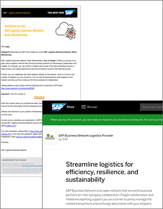

# How to integrate with SAP LBN APIs - a step by step guide

The goal of this page is to provide a description of the required steps and the required sequence of the same, in order to integrate against SAP LBN APIs. Therefore the content is targeting the developer persona, that has mostly worked as an integration specialist. The description is valid for both Freight Collaboration Option (FC), as well as Global Track and Trace Option (GTT).

Questions can be raised via the GitHub issues section within this repository. The issues section is being monitored actively - [ask a question](https://github.com/SAP-samples/logistics-business-network-integration/issues).
You might also want to take a look at the below [glossary](https://github.com/SAP-samples/logistics-business-network-integration#glossary).

## 0.) Get an overview of SAP LBN

[Click here](https://sapvideoa35699dc5.hana.ondemand.com/?entry_id=1_kse4obrb) to view a video introduction session for the LBN Network - an introduction for carrier networks! [Click here](https://sapvideoa35699dc5.hana.ondemand.com/?entry_id=1_o1pafhm5) to view a video introduction session for the LBN Network - for API enabled carriers!

Feel free to click through [these slides](Upload/SAP_LBN_FC_FOR_CARRIER_NETWORKS.pdf) to get further information on the carrier networks. [These slides](Upload/SAP_LBN_FC_FOR_CARRIERS.pdf) will show you more information about API enabled carriers.

## 1.) Get to know SAP LBN and APIs

All LBN APIs are documented in SAP API hub. 
To view the relevent Freight Collaboration Option (FC) APIs click [here](https://api.sap.com/package/LbnFreightCollaborationTenderingSubcontracting?section=Artifacts) and filter based on type 'Rest'.
To view the relevent Global Track and Trace Option (GTT) APIs click [here](https://api.sap.com/package/LbnGlobalTrackAndTrace?section=Artifacts) and filter based on type 'Rest'.
This video will provide you an overview of the APIs used for the various Freight Collaboration Option scenarios [click here](https://sapvideoa35699dc5.hana.ondemand.com/?entry_id=1_56hc08n2).

Additionally, to understand the details of the individual scenarios click on the listed description below.
You can view the slides used in these presentations by clicking on this [link](Upload/APIOverviewSlides.pdf).
  - [Tendering API](https://sapvideoa35699dc5.hana.ondemand.com/?entry_id=1_arll0fdg)
  - [Subcontracting API](https://sapvideoa35699dc5.hana.ondemand.com/?entry_id=1_0nq8qf49)
  - [Tracking API](https://sapvideoa35699dc5.hana.ondemand.com/?entry_id=1_z9pmf751)
  
For Global Track and Trace Option you can refer to the same Tracking API description as for Freight Collaboration Option above, as they are the same: [Tracking API](https://sapvideoa35699dc5.hana.ondemand.com/?entry_id=1_z9pmf751).

## 2.) Request tenant and technical user

Before you can actually start connecting against LBN, you need to request the two below items:
- Tenant
- Technical User

### 2.1) Requesting a tenant

As a prerequisit for connecting to / integrating with SAP LBN APIs,
you are required to have tenants in LBN available which are specific to your company.

For this you will have to request two tenants, one that will serve the development and test purposes,
and a second one for productive usage.

This section focuses on requesting the development/test tenant.
Section 5 will guide you through requesting your productive tenant.

 

#### A. Tenant and License description ###

License Nr 8007828 – Free of Charge *Test tenant to develop & test connectivity with standard LBN APIs* 
* For carrier/partner integration phase: mapping to SAP LBN APIs and end-to-end testing for both Freight Collaboration & Global Track and Trace options 
* Also for customer testing/implementation project with testing of integration to the partner network

#### B. License coverage details
* SAP Logistics Business Network B2B Test Tenant for carriers and network partners
* License to set-up B2B connections for
  * Mapping to SAP Logistics Business Network standard APIs
  * Integration testing 
  * Set-up and testing of B2B connections with SAP Logistics Business Network shipper customer test tenants
* An unlimited number of connections 
* Related usage of SAP Cloud Identity and SAP Fiori
* Standard SAP cloud support for SAP Logistics Business Network and standard APIs

#### C. Requesting the B2B test tenant 

Please request your B2B test tenant via following URL: https://www.sapstore.com/solutions/46401/SAP-Logistics-Business-Network%2C-B2B-test-tenant

#### D. Configuring the B2B test tenant

To perform the remaining configurations of your B2B test tenant please follow the content of the following [document](https://help.sap.com/viewer/b29693ac52074747b7010a02932fe47d/LBN/en-US).

### 2.2) Requesting a technical user

For all the LBN provider APIs (inbound to LBN), when you call our endpoint, you would need to  procure an OAuth 2.0 client ID and secret. This can be procured by reporting an incident. Use the application component SCM-LBN-INT in [sap support portal](https://support.sap.com/) Please mention the LBNID created for your account. To know the LBN ID, login to SAP LBN  and open the business profile tile.

## 3.) Integrate with SAP LBN APIs

You may use these [postman sample payloads](Upload/SamplePayload/) to build your mappings and endpoints.

Once your APIs are ready, you can configure the endpoints to our test landscape. To configure them, you will have to login to SAP LBN and maintain your endpoints that SAP LBN needs to call.
You may refere to this [video](https://video.sap.com/media/t/1_igc0uy3u) to view how to setup outbound connections and inbound connections, as well as this [documentation](https://help.sap.com/viewer/185742008f2c477ca789b93675b0ec6c/LBN/en-US/011fbcd85017450587389c4a10190077.html).

The OAuth Id and secret that you requested earlier, will be needed by you to call our endpoint for all the provider APIs.

This the [LBN endpoint](https://l20398-iflmap.hcisbp.eu1.hana.ondemand.com/http/v1h) that you need to call: https://l20398-iflmap.hcisbp.eu1.hana.ondemand.com/http/v1h .

## 4.) Testing 

To test , you can generate a test call from the system connection app. you may refer the document [here](https://help.sap.com/viewer/185742008f2c477ca789b93675b0ec6c/LBN/en-US/21f87b4b5d1547a5b7c185be5e764203.html) on how to generate a test payload.

## 5.) Release for productive usage

### 5.1) Requesting the productive tenant

#### A. Customer connectivity
License 8007133 – Free of charge
**Productive tenant for connectivity and transaction processing / data sharing with shippers*** 
* Covers both Freight Collaboration & Global Track and Trace options
* Enables business partner entry and discovery in the business partner directory 
* Enables listing and representation in SAP Logistics Business Network go-to-market materials

#### B. License coverage details

* SAP Logistics Business Network membership as a carrier or network partner
* License to collaborate / transact with connected shipper customers via the SAP Logistics Business Network for:
  * Freight Requests for Quotation and freight order confirmation / rejectiion 
  * Order tracking 
  * Web-based access for documents exchange
* An unlimited number of connections 
* Related usage of SAP Cloud Identity and SAP Fiori
* Standard SAP cloud support for SAP Logistics Business Network and standard APIs

#### C.1  Request productive membership invitation: 
* On completion of mapping and integration testing only
* Case 1: A shipper has already invited you - no additional activity at this step required.
* Case 2: Invitation request to be sent to network enablement validation via email: sap.dsc.network.enablement@sap.com 
#### C.2   Order the basic membership license
* After successful completion of step C.1
* In the SAP Store via Hyperlink here
* Or via URL:https://www.sapstore.com/solutions/46399/SAP-Logistics-Business-Network%2C-Basic-Membership
* Using your purchase order number provided in the invitation email sent from network enablement 

#### D. Configuring Productive Tenant

To perform the remaining configurations of your productive tenant please follow the content of the following [document](https://help.sap.com/viewer/b29693ac52074747b7010a02932fe47d/LBN/en-US). This contains important settings, like for example the visibility to shippers in the Business Partner Directory.

Watch [this recording](https://www.kaltura.com/p/1921661/sp/192166100/embedIframeJs/uiconf_id/37285991/partner_id/1921661?iframeembed=true&playerId=kaltura_player&entry_id=1_87fynq6n)
to have the steps explained visually.

### 5.2) API and Endpoint Configuration

For all the LBN provider APIs, when you call our endpoint, you would need to request or procure an OAuth 2.0 client Id and secret. This can be procured by reporting an incident . Use the  application component - SCM-LBN-INT in [sap support portal](https://support.sap.com/). Please mention the LBNID created for you account. To know the LBN ID, login to SAP LBN and open the business profile tile.

The OAuth Id will be needed by you to call our endpoint for all the provider APIs.

The [LBN endpoint](https://l20398-iflmap.hcisbp.eu1.hana.ondemand.com/http/v1
) that you need to call.

The step above is same as the one you have request for test access. But the OAuth ID and secret will be separate for productive access.

Configure system connection in LBN for productive tenant.Repeat the activities carried out on System connection App in the test tenant ( [Click here](https://video.sap.com/media/t/1_igc0uy3u) ). This time maintain your productive URL

Follow activities as done in step 3 to your productive URLs.

### 5.3) Smoke Test

Raise an incident in SCM-LBN-INT for a smoke test. We will facilitate an example order to your system . This activity will be done manually. 

## 6.) Become an SAP PartnerEdge Partner

As a network provider, with delivered connectivity to the SAP Logistics Business Network, your next step is to become an SAP PartnerEdge member. SAP PartnerEdge provides network solution and content providers an official SAP Partner status to allow joint go-to-market and marketing with SAP. You will profit from inclusion in the global go-to-market assets and enablement activities for the SAP Logistics Business Network. As a partner, you may issue SAP-supported press releases, participate in SAP events, and publish co-branded marketing materials for the joint solution and partnership. You will also have access to SAP partner management, for example to connect you with the relevant SAP stakeholders for opportunity and customer project alignment. Furthermore, with PartnerEdge membership, your solution will be included in the SAP APP Center for marketing and sales to SAP customers.   
 
 

To become a PartnerEdge member, you will need to complete the following:
1.	SAP PartnerEdge Build, Integrate application
2.	Application Readiness Check (ARC) for solution validation 
3.	Due Diligence check for compliance validation
4.	SAP App Center account and solution listing
 
Find out more [here](https://www.sap.com/partner/become/partneredge-build.html).

## Glossary

- API: Application Programming Interface

## How to obtain support

If you have further questions, please post them here [this repository](https://github.com/SAP-samples/logistics-business-network-integration/issues)

## License
Copyright (c) 2020 SAP SE or an SAP affiliate company. All rights reserved. This project is licensed under the Apache Software License, version 2.0 except as noted otherwise in the [LICENSE](LICENSES/Apache-2.0.txt) file.
